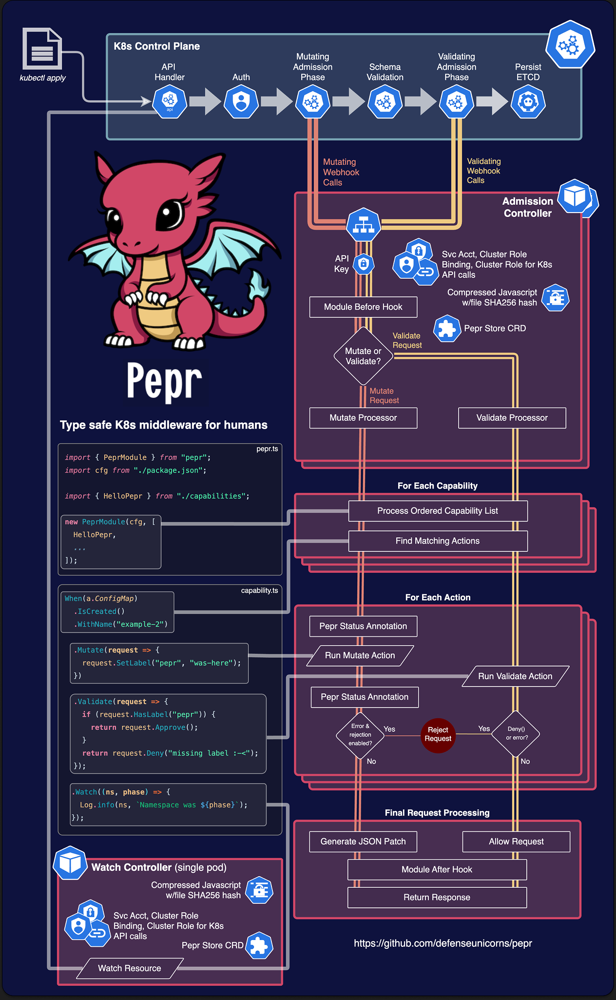

# Pepr

| | | |
| :--- | :--- | :--- |
| [](https://docs.pepr.dev) | [](https://npmjs.com/package/pepr) | [](https://snyk.io/advisor/npm-package/pepr) |
| [](https://npmjs.com/package/pepr) | [](https://npmjs.com/package/pepr) | [](https://securityscorecards.dev/viewer/?uri=github.com/defenseunicorns/pepr) |
| [](https://codecov.io/github/defenseunicorns/pepr) | [](/contribute/code-of-conduct) | |

## What happened to Pepr's stars?

In February 2025, an accidental change to the repository's visibility reset the star count.
The visibility issue was quickly resolved, but the stars were unfortunately lost.

Pepr had over 200 stars, demonstrating its recognition and value within the Kubernetes community.
We're working to rebuild that recognition.

If you've previously starred Pepr, or if you find it a useful project, we would greatly appreciate it if you could re-star the repository.
We really appreciate your support!

## **_Type safe Kubernetes middleware for humans_**

<!-- markdownlint-disable MD033 -->

<table border="0" cellspacing="0" cellpadding="0">
<tr>
<td width="65%" style="vertical-align: middle; border: none;">
<div>
Pepr simplifies Kubernetes management by providing an alternative to complex YAML configurations, custom scripts, and ad-hoc solutions.
As a Kubernetes controller, Pepr enables you to define Kubernetes transformations using TypeScript, accessible through straightforward configurations even without extensive development expertise.
Pepr transforms disparate implementation approaches into a cohesive, well-structured, and maintainable system.
With Pepr, you can efficiently convert organizational knowledge into code, improving documentation, testing, validation, and change management for more predictable outcomes.
</div>
</td>
<td width="35%" align="center" style="vertical-align: middle; border: none;">

</td>
</tr>
</table>

<!-- markdownlint-enable MD033 -->

## Features

- Zero-config K8s Mutating and Validating Webhooks plus Controller generation
- Automatic leader-elected K8s resource watching
- Lightweight async key-value store backed by K8s for stateful operations with the [Pepr Store](/user-guide/store)
- Human-readable fluent API for generating [Pepr Capabilities](#capability)
- A fluent API for creating/modifying/watching and server-side applying K8s resources via [Kubernetes Fluent Client](https://github.com/defenseunicorns/kubernetes-fluent-client)
- Generate new K8s resources based off of cluster resource changes
- Perform other exec/API calls based off of cluster resources changes or any other arbitrary schedule
- Out of the box airgap support with [Zarf](https://zarf.dev)
- Entire NPM ecosystem available for advanced operations
- Realtime K8s debugging system for testing/reacting to cluster changes
- Controller network isolation and tamper-resistant module execution
- Least-privilege [RBAC](/user-guide/rbac) generation
- AMD64 and ARM64 support

## Example Pepr Action

This quick sample shows how to react to a ConfigMap being created or updated in the cluster.
It adds a label and annotation to the ConfigMap and adds some data to the ConfigMap.
It also creates a Validating Webhook to make sure the "pepr" label still exists.
Finally, after the ConfigMap is created, it logs a message to the Pepr controller and creates or updates a separate ConfigMap with the [kubernetes-fluent-client](https://github.com/defenseunicorns/kubernetes-fluent-client) using server-side apply.
For more details see [actions](/actions/) section.

```ts
When(a.ConfigMap)
  .IsCreatedOrUpdated()
  .InNamespace("pepr-demo")
  .WithLabel("example", "value")
  // Create a Mutate Action for the ConfigMap
  .Mutate(request => {
    // Add a label and annotation to the ConfigMap
    request.SetLabel("pepr", "was-here").SetAnnotation("pepr.dev", "annotations-work-too");

    // Add some data to the ConfigMap
    request.Raw.data["doug-says"] = "Pepr is awesome!";

    // Log a message to the Pepr controller logs
    Log.info("A ConfigMap was created or updated:");
  })
  // Create a Validate Action for the ConfigMap
  .Validate(request => {
    // Validate the ConfigMap has a specific label
    if (request.HasLabel("pepr")) {
      return request.Approve();
    }

    // Reject the ConfigMap if it doesn't have the label
    return request.Deny("ConfigMap must have the required pepr label");
  })
  // Watch behaves like controller-runtime's Manager.Watch()
  .Watch(async (cm, phase) => {
    Log.info(cm, `ConfigMap was ${phase}.`);

    // Apply a ConfigMap using K8s server-side apply (will create or update)
    await K8s(kind.ConfigMap).Apply({
      metadata: {
        name: "pepr-ssa-demo",
        namespace: "pepr-demo-2",
      },
      data: {
        uid: cm.metadata.uid,
      },
    });
  });
```

## Prerequisites

- [Node.js](https://nodejs.org/en/) v20.0.0+ (even-numbered releases only)
  - To ensure compatibility and optimal performance, it is recommended to use even-numbered releases of Node.js as they are stable releases and receive long-term support for three years.
    Odd-numbered releases are experimental and may not be supported by certain libraries utilized in Pepr.

- [npm](https://www.npmjs.com/) v10.1.0+

- Recommended (optional) tools:
  - [Visual Studio Code](https://code.visualstudio.com/) for inline debugging and [Pepr Capabilities](#capability) creation.
  - A Kubernetes cluster for `npx pepr dev`. Pepr modules include `npm run k3d-setup` if you want to test locally with [K3d](https://k3d.io/) and [Docker](https://www.docker.com/).

## Quick Start Guide

```bash
# Create a new Pepr Module
npx pepr init

# If you already have a K3d cluster you want to use, skip this step
npm run k3d-setup

# Start playing with Pepr now!
# If using Kind, or another local k8s distro instead,
# run `npx pepr dev --host <your_hostname>`
npx pepr dev
kubectl apply -f capabilities/hello-pepr.samples.yaml
```

:::tip
Don't use IP as your `--host`, it's not supported. Make sure to check your
local k8s distro documentation how to reach your localhost, which is where
`pepr dev` is serving the code from.
:::

  <video controls width="100%">
    <source src="https://user-images.githubusercontent.com/882485/230895880-c5623077-f811-4870-bb9f-9bb8e5edc118.mp4" type="video/mp4">
    <p>Your browser doesn't support HTML video. <a href="https://user-images.githubusercontent.com/882485/230895880-c5623077-f811-4870-bb9f-9bb8e5edc118.mp4">Download the video</a> instead.</p>
  </video>

## Concepts

### Module

A module is the top-level collection of capabilities.
It is a single, complete TypeScript project that includes an entry point to load all the configuration and capabilities, along with their actions.
During the Pepr build process, each module produces a unique Kubernetes MutatingWebhookConfiguration and ValidatingWebhookConfiguration, along with a secret containing the transpiled and compressed TypeScript code.
The webhooks and secret are deployed into the Kubernetes cluster with their own isolated controller.

See [Module](/user-guide/pepr-modules) for more details.

### Capability

A capability is set of related actions that work together to achieve a specific transformation or operation on Kubernetes resources.
Capabilities are user-defined and can include one or more actions.
They are defined within a Pepr module and can be used in both MutatingWebhookConfigurations and ValidatingWebhookConfigurations.
A Capability can have a specific scope, such as mutating or validating, and can be reused in multiple Pepr modules.

See [Capabilities](/user-guide/capabilities) for more details.

### Action

Action is a discrete set of behaviors defined in a single function that acts on a given Kubernetes GroupVersionKind (GVK) passed in from Kubernetes.
Actions are the atomic operations that are performed on Kubernetes resources by Pepr.

For example, an action could be responsible for adding a specific label to a Kubernetes resource, or for modifying a specific field in a resource's metadata.
Actions can be grouped together within a Capability to provide a more comprehensive set of operations that can be performed on Kubernetes resources.

There are both `Mutate()` and `Validate()` Actions that can be used to modify or validate Kubernetes resources within the admission controller lifecycle.
There are also `Watch()` and `Reconcile()` actions that can be used to watch for changes to Kubernetes resources that already exist.
Finally, the `Finalize()` can be used after `Watch()` or `Reconcile()` to perform cleanup operations when the resource is deleted.

See [actions](/actions/) for more details.

## Logical Pepr Flow



## TypeScript

[TypeScript](https://www.typescriptlang.org/) is a strongly typed, object-oriented programming language built on top of JavaScript.
It provides optional static typing and a rich type system, allowing developers to write more robust code.
TypeScript is transpiled to JavaScript, enabling it to run in any environment that supports JavaScript.
Pepr allows you to use JavaScript or TypeScript to write capabilities, but TypeScript is recommended for its type safety and rich type system.
See the [Typescript docs](https://www.typescriptlang.org/docs/handbook/typescript-from-scratch.html) to learn more.

## Community

To join our channel go to [Kubernetes Slack](https://communityinviter.com/apps/kubernetes/community) and join the `#pepr` channel.

[contributors]: https://contrib.rocks/image?repo=defenseunicorns/pepr
[![Contributor Chart][contributors]](https://github.com/defenseunicorns/pepr/graphs/contributors)

Made with [contrib.rocks](https://contrib.rocks).
