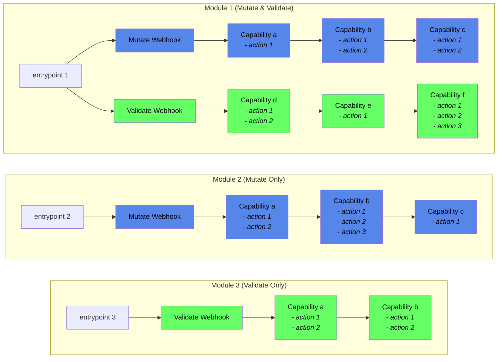

# Pepr


Pepr is an open-source project that helps IT Ops teams of all skill levels manage and modify resources in a Kubernetes (K8s) cluster using TypeScript. Kubernetes simplifies the management of multiple computers working together to run and scale applications. Pepr acts as a smart assistant, automatically changing or validating parts of the system as needed.

TypeScript is used to create Pepr capabilities, benefiting from its error-catching and clean code features, but without requiring specialized software engineering experience or prior Typescript knowledge. Pepr also provides a user-friendly interface for writing commands in plain English in a [Fluent Interface](https://en.wikipedia.org/wiki/Fluent_interface) style.

Capabilities are logical groupings of actions, which are the atomic units of change within Pepr. Actions _modify_, _create_, or _interact_ with resources in response to events. Pepr's capabilities and actions work together in the cluster, offering a versatile and customizable tool that enhances Kubernetes by building glue code or plumbing for system interactions. This makes Pepr useful for various tasks such as creating robust policy engines or seamlessly connecting applications.

Imagine Pepr as a smart home system where different devices communicate with each other. Pepr provides instructions, simplifying the management of the smart home. The project enables both expert and novice capability authors to improve management and interactions within the Kubernetes environment, making its features accessible to everyone.

## Features

- Define a set of Kubernetes transformations/actions as Pepr capabilities.
- Write capabilities in TypeScript and bundle them for in-cluster processing in [NodeJS](https://nodejs.org/).
- React to cluster resources by mutating them, creating new Kubernetes resources, or performing arbitrary exec/API operations.

## Concepts

### Module

A module is the top-level collection of capabilities. It is a single, complete TypeScript project that includes an entry point to load all the configuration and capabilities, along with their CapabilityActions. During the Pepr build process, each module produces a unique Kubernetes MutatingWebhookConfiguration and ValidatingWebhookConfiguration, along with a secret containing the transpiled and compressed TypeScript code. The webhooks and secret are deployed into the Kubernetes cluster for processing by a common Pepr controller.

### Capability

A capability is set of related CapabilityActions that work together to achieve a specific transformation or operation on Kubernetes resources. Capabilities are user-defined and can include one or more CapabilityActions. They are defined within a Pepr module and can be used in both MutatingWebhookConfigurations and ValidatingWebhookConfigurations. A Capability can have a specific scope, such as mutating or validating, and can be reused in multiple Pepr modules.

### CapabilityAction

CapabilityAction is a discrete set of behaviors defined in a single function that acts on a given Kubernetes GroupVersionKind (GVK) passed in from Kubernetes. CapabilityActions are the atomic operations that are performed on Kubernetes resources by Pepr.

For example, a CapabilityAction could be responsible for adding a specific label to a Kubernetes resource, or for modifying a specific field in a resource's metadata. CapabilityActions can be grouped together within a Capability to provide a more comprehensive set of operations that can be performed on Kubernetes resources.

## Example

Define a new capability:

```
pepr new hello-world -d demo
```

This will create a new directory tree called `demo/hello-world` with the following structure:

### demo/hello-world/index.ts

```typescript
import "./test-mutations";
```

### demo/hello-world/index.ts

```typescript
import { Capability, a } from "pepr";

const { When } = new Capability({
  // The unique name of the capability
  name: "hello-world",
  // A short description of the capability
  description: "Type a useful description here 🦄",
  // Limit what namespaces the capability can be used in (optional)
  namespaces: [],
});
```

Next, we need to define some actions to perform when specific Kubernetes resources are created, updated or deleted in the cluster. Pepr provides a set of actions that can be used to react to Kubernetes resources, such as `a.Pod`, `a.Deployment`, `a.CronJob`, etc. These actions can be chained together to create complex conditions, such as `a.Pod.IsCreated().InNamespace("default")` or `a.Deployment.IsUpdated().WithLabel("changeme=true")`. Below is an example of a capability that reacts to the creation of a Deployment resource:

```typescript
When(a.Deployment)
  .IsCreated()
  .ThenSet({
    spec: {
      minReadySeconds: 3,
    },
  });
```

Here's a more complex example that reacts to the creation of a Deployment resource:

```typescript
When(a.Deployment)
  .IsCreatedOrUpdated()
  .InNamespace("ns1", "ns2")
  .WithLabel("changeme", "true")
  .Then(request => {
    request
      .SetLabel("mutated", "true")
      .SetLabel("test", "thing")
      .SetAnnotation("test2", "thing")
      .RemoveLabel("test3");

    if (request.HasLabel("test")) {
      request.SetLabel("test5", "thing");
    }

    const { spec } = request.Raw;
    spec.strategy.type = "Recreate";
    spec.minReadySeconds = 3;

    if (request.PermitSideEffects) {
      // Do side-effect inducing things
    }
  });
```

Now you can build and bundle your capability:

```
pepr build hello-world
```

## Logical Pepr Flow



## TypeScript

[TypeScript](https://www.typescriptlang.org/) is a strongly typed, object-oriented programming language built on top of JavaScript. It provides optional static typing and a rich type system, allowing developers to write more robust code. TypeScript is transpiled to JavaScript, enabling it to run in any environment that supports JavaScript. Pepr allows you to use JavaScript or TypeScript to write capabilities, but TypeScript is recommended for its type safety and rich type system. You can learn more about TypeScript [here](https://www.typescriptlang.org/docs/handbook/typescript-from-scratch.html).

## Kubernetes Mutating Webhooks

[Kubernetes mutating webhooks](https://kubernetes.io/docs/reference/access-authn-authz/extensible-admission-controllers/)are a powerful feature that allows users to intercept and modify Kubernetes API requests, such as resource creation or updates, before they are persisted to the cluster. They can be used to enforce security policies, default values, or perform custom transformations on resources.

Pepr uses Kubernetes mutating webhooks to react to cluster resource events and apply user-defined capabilities, which are sets of Kubernetes transformations/actions.
