# Pepr

Pepr is an open-source project licensed under the Apache 2 license, designed to be a declarative Kubernetes configuration system that automates application reconfiguration. It allows users to interact with user-defined "capabilities" that react to Kubernetes mutating webhook events.

## Features

- Define a set of Kubernetes transformations/actions as Pepr capabilities.
- Write capabilities in TypeScript and bundle them for in-cluster processing using [v8go](https://github.com/rogchap/v8go) and V8 isolates (cached for performance).
- React to cluster resources by mutating them, creating new Kubernetes resources, or performing arbitrary API calls.

## Concepts

### Module

A module is the top-level collection of capabilities. It is a single, complete TypeScript project that includes an entry point to load all the configuration and capabilities, along with their capability actions. During the Pepr build process, each module produces a unique Kubernetes MutatingWebhookConfiguration and ValidatingWebhookConfiguration, along with a secret containing the transpiled and compressed TypeScript code. The webhooks and secret are deployed into the Kubernetes cluster for processing by a common Pepr controller.

### Capability

A capability is set of related CapabilityActions that work together to achieve a specific transformation or operation on Kubernetes resources. Capabilities are user-defined and can include one or more CapabilityActions. They are defined within a Pepr module and can be used in both MutatingWebhookConfigurations and ValidatingWebhookConfigurations. A Capability can have a specific scope, such as mutating or validating, and can be used in multiple Pepr modules if needed.

### CapabilityAction

CapabilityAction is a discrete set of behaviors defined in a single function that acts on a given Kubernetes GroupVersionKind (GVK) passed in from Kubernetes. CapabilityActions are the atomic operations that are performed on Kubernetes resources by Pepr.

For example, a CapabilityAction could be responsible for adding a specific label to a Kubernetes resource, or for modifying a specific field in a resource's metadata. CapabilityActions can be grouped together within a Capability to provide a more comprehensive set of operations that can be performed on Kubernetes resources.

## Example

Define a new capability:

```
pepr new hello-world -d demo
```

This will create a new directory tree called `demo/hello-world` with the following structure:

### demo/hello-world/default.ts

```typescript
import "./test-mutations";
```

### demo/hello-world/index.ts

```typescript
import { a } from "@k8s";
import { Capability } from "@pepr";

const { When } = new Capability({
  // The unique name of the capability
  name: "hello-world",
  // A short description of the capability
  description: "Type a useful description here 🦄",
  // Limit what namespaces the capability can be used in (optional)
  namespaces: [],
});
```

Next, we need to define some actions to perform when specific Kubernetes resources are created, updated or deleted in the cluster. Pepr provides a set of actions that can be used to react to Kubernetes resources, such as `a.Pod`, `a.Deployment`, `a.CronJob`, etc. These actions can be chained together to create complex conditions, such as `a.Pod.IsCreated().InNamespace("default")` or `a.Deployment.IsUpdated().WithLabel("changeme=true")`. Below is an example of a capability that reacts to the creation of a CronJob resource:

```typescript
When(a.CronJob).IsCreated().Then(modifyCronJobSchedule);

function modifyCronJobSchedule(cronJob: Action<CronJob>) {
  cronJob.Raw.spec.schedule = "*/5 * * * *";
}
```

Here's a more complex example that reacts to the creation of a Deployment resource:

```typescript
When(a.Deployment)
  .IsCreatedOrUpdated()
  .InNamespace("mutation-namespace")
  .WithLabel("changeme", "true")
  .Then(changeABunchOfDeploymentThings);

function changeABunchOfDeploymentThings(deployment: Action<Deployment>) {
  deployment
    .SetLabel("mutated", "true")
    .SetLabel("test", "thing")
    .SetAnnotation("test2", "thing")
    .RemoveLabel("test3");

  if (deployment.HasLabel("test")) {
    deployment.SetLabel("test5", "thing");
  }

  let { spec } = deployment.Raw;
  spec.strategy.type = "Recreate";
  spec.minReadySeconds = 3;

  if (deployment.PermitSideEffects) {
    // Do side-effect inducing things
  }
}
```

Now you can build and bundle your capability:

```
pepr build hello-world
```

## Logical Pepr Flow

```mermaid
graph TD

subgraph M1["Module 1 (Mutate & Validate)"]
    direction LR
    A(MutatingWebhookConfiguration) --> PR1;
    B(ValidatingWebhookConfiguration) --> PR1;
    
    PR1{Pepr Runtime} --> C(use module 1)
    
    C -->|mutate| D(Capability a <br><i>- action 1</i>);
    D --> E(Capability b <br><i>- action 1<br>- action 2</i>);
    E --> F(Capability c <br><i>- action 1<br>- action 2</i>);
    
    C -->|validate| G(Capability d <br><i>- action 1<br>- action 2</i>);
    G --> H(Capability e <br><i>- action 1</i>);
    H --> I(Capability f <br><i>- action 1<br>- action 2<br>- action 3</i>);

    Out1("Result →")
    F --> Out1
    I --> Out1
end

subgraph M2["Module 2 (Mutate Only)"]
    direction LR
    K(MutatingWebhookConfiguration) --> PR2;

    PR2{Pepr Runtime} -->L(use module 2) -->|mutate| M

    M(Capability a <br><i>- action 1<br>- action 2</i>);
    M --> N(Capability b <br><i>- action 1<br>- action 2<br>- action 3</i>);
    N --> O(Capability c <br><i>- action 1</i>);

    O --> Out2("Result →")
end

subgraph M3["Module 3 (Validate Only)"]
    direction LR
    Q(ValidatingWebhookConfiguration) --> PR3

    PR3{Pepr Runtime} -->R(use module 3) -->|validate| S

    S(Capability a <br><i>- action 1<br>- action 2</i>);
    S --> T(Capability b <br><i>- action 1<br>- action 2</i>);

    T --> Out3("Result →")
end

cp1(K8s Control Plane) ==>|AdmissionRequest| M1 ==>|AdmissionResponse| cp2(K8s Control Plane)

cp2 ==>|AdmissionRequest| M2 ==>|AdmissionResponse| cp3(K8s Control Plane)

cp3 ==>|AdmissionRequest| M3 ==>|AdmissionResponse| CP4(K8s Control Plane)

%% Defining node styles
classDef Validate fill:#66ff66,color:#000;
classDef Mutate fill:#5786ea,color:#000;


class K,M,N,O Mutate;
class A,D,E,F Mutate;

class Q,S,T Validate;
class B,G,H,I Validate;
```



## TypeScript

[TypeScript](https://www.typescriptlang.org/) is a strongly typed, object-oriented programming language built on top of JavaScript. It provides optional static typing and a rich type system, allowing developers to write more robust code. TypeScript is transpiled to JavaScript, enabling it to run in any environment that supports JavaScript. Pepr allows you to use JavaScript or TypeScript to write capabilities, but TypeScript is recommended for its type safety and rich type system. You can learn more about TypeScript [here](https://www.typescriptlang.org/docs/handbook/typescript-from-scratch.html).

## V8 and V8 Isolates

[V8](https://v8.dev/) is an open-source JavaScript engine developed by Google. It is responsible for running JavaScript code in Google Chrome and other web browsers based on the Chromium project. V8 is also used as the runtime for Node.js.

V8 Isolates are lightweight instances of the V8 engine that allow running multiple JavaScript contexts in parallel while maintaining isolation between them. Each isolate has its own memory heap and can execute JavaScript code independently, making them ideal for running untrusted code, parallelizing tasks, or sandboxing.

[v8go](https://github.com/rogchap/v8go) is a Go library that enables you to run JavaScript code using the V8 engine, leveraging the performance benefits of V8 Isolates. In Pepr, v8go is used to execute TypeScript code bundled for in-cluster processing.

## Kubernetes Mutating Webhooks

Kubernetes mutating webhooks are a powerful feature that allows users to intercept and modify Kubernetes API requests, such as resource creation or updates, before they are persisted to the cluster. They can be used to enforce security policies, default values, or perform custom transformations on resources.

Pepr uses Kubernetes mutating webhooks to react to cluster resource events and apply user-defined capabilities, which are sets of Kubernetes transformations/actions.
