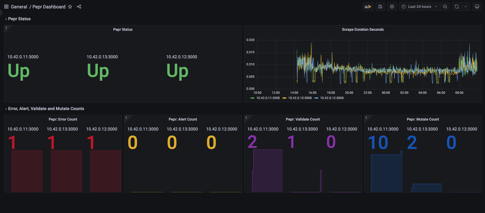

# Tutorial - Create a Pepr Dashboard

## Introduction

This tutorial will walk you through the process of creating a dashboard to display your Pepr metrics. This dashboard will present data such as the number of validation requests processed, the number of mutation requests that were allowed, the number of errors that were processed, the number of alerts that were processed, the status of the Pepr pods, and the scrape duration of the Pepr pods. This dashboard will be created using [Grafana](https://grafana.com/). The dashboard will display data from [Prometheus](https://prometheus.io/), which is a monitoring system that Pepr uses to collect metrics.

This tutorial is not intended for production, but instead is intended to show how to quickly scrape Pepr metrics. The [kube prometheus stack](https://github.com/prometheus-community/helm-charts/tree/main/charts/kube-prometheus-stack) provides a more production suitable way of deploying Prometheus in prod.

An example of what the dashboard will look like is shown below:



***Note:*** *The dashboard shown above is an example of what the dashboard will look like. The dashboard will be populated with data from your Pepr instance.*

## Prerequisites

1. Have a Pepr module created and deployed. If you do not have a Pepr module created and deployed, follow the [Create a Pepr Module](010_create-pepr-module.md) tutorial.
2. Have a local Kubernetes cluster running. If you do not have a local Kubernetes cluster running, follow the [Create a Pepr Module](010_create-pepr-module.md) tutorial.

## Steps

### **Create a Prometheus deployment**

#### Apply the CRDs to your cluster

    ```bash
    kubectl create -f https://raw.githubusercontent.com/prometheus-operator/prometheus-operator/main/bundle.yaml
    ```

    This command creates in the `default` namespace the necessary Custom Resource Definitions that the Prometheus Operator will use.

#### Apply the [Prometheus Operator deployment](../../dashboards/prometheus-operator.yaml) to your cluster

    ```bash
    kubectl create -f prometheus-deployment.yaml
    ```

    This creates an instance of Prometheus in your Kubernetes cluster.

#### Create a ClusterRole to allow for scraping

    ```bash
    kubectl apply -f prometheus-cr.yaml
    ```
    This creates a ClusterRole that allows for scraping.

#### Create the [cluster role binding and ServiceMonitors](../../dashboards/prometheus-operator.yaml) to your cluster

    ```bash
    kubectl create -f prometheus-operator.yaml
    ```

    This creates a Prometheus Operator in your Kubernetes cluster.

##### Setup Port Forwarding

    First, confirm that your prometheus-operator service is running on port 9090:

    ```
    k get svc
    ```

    You should see something similar to:

    ```
    NAME                  TYPE        CLUSTER-IP   EXTERNAL-IP   PORT(S)    AGE
    kubernetes            ClusterIP   10.43.0.1    <none>        443/TCP    18m
    prometheus-operator   ClusterIP   None         <none>        8080/TCP   100s
    prometheus-operated   ClusterIP   None         <none>        9090/TCP   62s
    ```

    You can now set up the port-forwarding so that you can view your Prometheus instance at `http://localhost:9090`:

    ```
    k port-forward svc/prometheus-operated 9090
    ```

### **Create a Grafana deployment**

#### Deploy the Grafana helm chart

    ```bash
    kubectl create ns grafana
    helm install grafana -n grafana oci://registry-1.docker.io/bitnamicharts/grafana-operator
    ```

#### Download and apply the [grafana-deployment.yaml](../../dashboards/grafana-deployment.yaml) file

    ```bash
    kubectl apply -f grafana-deployment.yaml
    ```

    Alternatively, to create a Grafana deployment, you can run the following command:

    ```bash
    kubectl apply -f https://raw.githubusercontent.com/defenseunicorns/pepr/main/dashboards/grafana-deployment.yaml
    ```

#### Deploy the ConfigMap with the Pepr dashboard json

    ```bash
    kubectl apply -f grafana-configmap.yaml
    ```

    Alternatively, to create a ConfigMap with the Pepr dashboard json, you can run the following command:

    ```bash
    kubectl apply -f https://raw.githubusercontent.com/defenseunicorns/pepr/main/dashboards/grafana-configmap.yaml
    ```

##### Setup Port Forwarding

    First, confirm that your grafana-service is running on port 3000:

    ```
    k get svc -n grafana
    ```

    You should see something similar to:

    ```
    grafana-grafana-operator-grafana-service   ClusterIP   10.43.168.97    <none>        3000/TCP   12m
    grafana-service                            ClusterIP   10.43.219.108   <none>        3000/TCP   11m
    ```

    You can now set up the port-forwarding so that Grafana can use the Prometheus data as a datasource:

    ```
    k port-forward svc/grafana-service 3000 --namespace grafana
    ```

### **Create a Grafana dashboard**

#### **Option 1**

    Download and apply the [dashboard-configmap.yaml](../../dashboards/dashboard-configmap.yaml) file:

    ```bash
    kubectl apply -f dashboard-configmap.yaml
    ```

    Alternatively, to create the Pepr Grafana dashboard, you can run the following command:

    ```bash
    kubectl apply -f https://raw.githubusercontent.com/defenseunicorns/pepr/main/dashboards/dashboard-configmap.yaml
    ```

    This will create a Grafana dashboard in the `pepr-dashboard` namespace. This dashboard will be named `Pepr Dashboard`. This dashboard will display data from Prometheus. The dashboard will display data such as the number of validation requests processed, the number of mutation requests that were allowed, the number of errors that were processed, the number of alerts that were processed, the status of the Pepr pods, and the scrape duration of the Pepr pods.

#### **Option 2**

    Import the dashboard from the [pepr-dashboard.json](../../dashboards/pepr-dashbord.json) file.

    To import the dashboard, follow the steps below:

    1. Navigate to the Grafana dashboard at `http://localhost:3000`.
    2. Click on the Dashboard icon on the left side of the screen.
    3. Click on `+ Import`.
    4. Click on `Upload JSON File`.
    5. Select the [Pepr Dashboard](../../dashboards/pepr-dashboard.json) file.
    6. Click on `Load`.
    7. Select the `Prometheus` data source.
    8. Click on `Import`.
    9. The dashboard will now be imported and displayed.
    10. Click on `Save Dashboard`.
    11. The dashboard will now be saved.

## Summary

This tutorial demonstrated how to use Prometheus and Grafana to display metrics from your Pepr instance. If you have questions about Pepr metrics or dashboards, please reach out to us on [Slack](https://kubernetes.slack.com/archives/C06DGH40UCB) or [GitHub Issues](https://github.com/defenseunicorns/pepr/issues)
