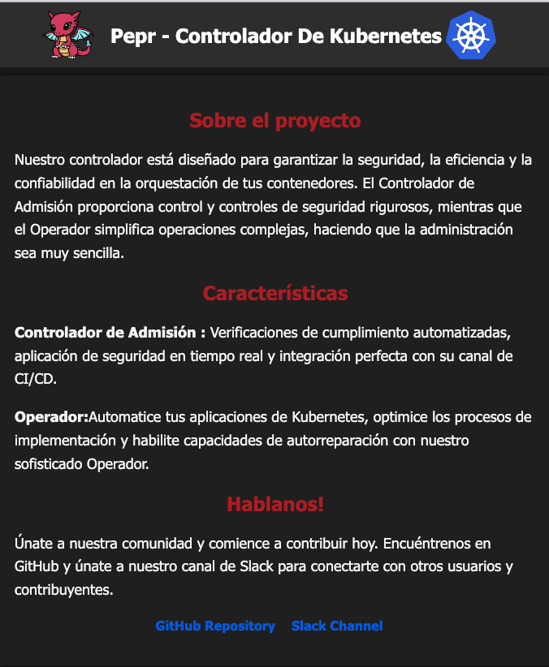

# Building a Kubernetes Operator with Pepr

## Introduction

This tutorial guides you through building a Kubernetes Operator using Pepr. You'll create a WebApp Operator that manages custom WebApp resources in your Kubernetes cluster.

If you get stuck at any point, you can reference the [complete example code in the Pepr Excellent Examples repository](https://github.com/defenseunicorns/pepr-excellent-examples/tree/main/pepr-operator).

## What You'll Build

The WebApp Operator will:

1. Deploy a custom `WebApp` resource definition (CRD)
2. Watch for WebApp instances and reconcile them with actual cluster state
3. For each WebApp instance, manage:
   - A `Deployment` with configurable replicas
   - A `Service` to expose the application
   - A `ConfigMap` containing configurable HTML with language and theme options

All resources will include `ownerReferences`, triggering cascading deletion when a WebApp is removed. The operator will also automatically restore any managed resources that are deleted externally.

[Back to top](#building-a-kubernetes-operator-with-pepr)

## Prerequisites

- A Kubernetes cluster (local or remote)
- Access to the `curl` command
- Basic understanding of Kubernetes concepts
- Familiarity with TypeScript
- Node.js ≥ 18.0

[Back to top](#building-a-kubernetes-operator-with-pepr)

## Tutorial Steps

1. [Create a new Pepr Module](#create-a-new-pepr-module)
2. [Define the WebApp CRD](#create-crd)
3. [Create Helper Functions](#create-helpers)
4. [Implement the Reconciler](#create-reconciler)
5. [Build and Deploy Your Operator](#build-and-deploy-your-operator)
6. [Test Your Operator](#test-your-operator)

[Back to top](#building-a-kubernetes-operator-with-pepr)

## Create a new Pepr Module

First, create a new Pepr module for your operator:

```bash
npx pepr init \
  --name operator \
  --uuid my-operator-uuid \
  --description "Kubernetes Controller for WebApp Resources" \
  --errorBehavior reject \
  --confirm
```

[Back to top](#building-a-kubernetes-operator-with-pepr)

## Create CRD

The WebApp Custom Resource Definition (CRD) specifies the structure and validation for your custom resource.
Create the necessary directory structure:

```bash
mkdir -p capabilities/crd/generated capabilities/crd/source
```

Create a CRD named `crd.yaml` for the WebApp that includes:
- Theme selection (dark/light)
- Language selection (en/es)
- Configurable replica count
- Status tracking

```bash
curl -s https://raw.githubusercontent.com/defenseunicorns/pepr-excellent-examples/main/pepr-operator/capabilities/crd/source/crd.yaml \
  -o capabilities/crd/source/crd.yaml
```

Examine the contents of `capabilities/crd/source/crd.yaml`.
Status should also be listed under `subresources` to make it writable.
We provide descriptions under the properties for clarity around what the property is used for.
Enums are useful to limit the values that can be used for a property.

Generate a class based on the WebApp CRD using [kubernetes-fluent-client](https://github.com/defenseunicorns/kubernetes-fluent-client).
This way we can react to the fields of the CRD in a type-safe manner.

```bash
npx kubernetes-fluent-client crd https://gist.githubusercontent.com/cmwylie19/69b765af5ab25af62696f3337df13687/raw/72f53db7ddc06fc8891dc81136a7c190bc70f41b/WebApp.yaml capabilities/crd/generated/
```

Examine the contents of `capabilities/crd/generated/webapp-v1alpha1.ts`

Change the first lines of `webapp-v1alphav1.ts` with the command:
<!-- Why do we do this? -->

```bash
sed -i '' '1,/Status;/c\
import { a, RegisterKind } from "pepr";\
export class WebApp extends a.GenericKind {\
    spec?:       Spec;\
    status?:     Status;\
' capabilities/crd/generated/webapp-v1alpha1.ts
```

In the `capabilities/crd/source` folder, create a file called `webapp.crd.ts` and add the following. This will have the controller automatically create the CRD when it starts.


Create a typescripte file that contains the webapp CRD named `webapp.crd.ts`.
This will have the controller automatically create the CRD on startup.
Use the command:

```bash
curl -s https://raw.githubusercontent.com/defenseunicorns/pepr-excellent-examples/main/pepr-operator/capabilities/crd/source/webapp.crd.ts \
  -o capabilities/crd/source/webapp.crd.ts
```

Examine `webapp.crd.ts` and observe...
<!-- Point out some useful things here -->

Create a file that will automatically register the CRD on startup named `capabilities/crd/register.ts`. Use the command:

```bash
curl -s https://raw.githubusercontent.com/defenseunicorns/pepr-excellent-examples/main/pepr-operator/capabilities/crd/register.ts \
  -o capabilities/crd/register.ts
```

Examine `register.ts` and observe...
<!-- Point out some useful things here -->


Create a file to ensure that instances of the WebApp resource are in valid namespaces and have a maximum of `7` replicas.
Create a `validator.ts` file with the command:

```bash
curl -s https://raw.githubusercontent.com/defenseunicorns/pepr-excellent-examples/main/pepr-operator/capabilities/crd/validator.ts \
  -o capabilities/crd/validator.ts
```

Examine `validator.ts` and observe...
<!-- Point out some useful things here -->

In this section we generated the CRD class for WebApp, created a function to auto register the CRD, and added a validator to validate that instances of WebApp are in valid namespaces and have a maximum of `7` replicas.

[Back to top](#building-a-kubernetes-operator-with-pepr)

## Create Helpers

Now, let's create helper functions that will generate the Kubernetes resources managed by our operator. These helpers will simplify the creation of Deployments, Services, and ConfigMaps for each WebApp instance.

Create a `controller` folder in the `capabilities` folder and create a `generators.ts` file. This file will contain functions that generate Kubernetes Objects for the Operator to deploy (with the ownerReferences auto-included). Since these resources are owned by the WebApp resource, they will be deleted when the WebApp resource is deleted.

```bash
mkdir -p capabilities/controller`
```

Create `generators.ts` with the following command:

```bash
curl -s https://raw.githubusercontent.com/defenseunicorns/pepr-excellent-examples/main/pepr-operator/capabilities/controller/generators.ts \
  -o capabilities/controller/generators.ts
```

Examine `generators.ts` and observe...
<!-- Point out some useful things here -->

Our job is to make the deployment of the WebApp simple. Instead of having to keep track of the versions and revisions of all of the Kubernetes Objects required for the WebApp, rolling pods and updating configMaps, the deployer now only needs to focus on the `WebApp` instance. The controller will reconcile instances of the operand (WebApp) against the actual cluster state to reach the desired state.

We decide which `ConfigMap` to deploy based on the language and theme specified in the WebApp resource and how many replicas to deploy based on the replicas specified in the WebApp resource.

[Back to top](#building-a-kubernetes-operator-with-pepr)

## Create Reconciler

Now, create the function that reacts to changes across WebApp instances. This function will be called and put into a queue, guaranteeing ordered and synchronous processing of events, even when the system may be under heavy load.

In the base of the `capabilities` folder, create a `reconciler.ts` file and add the following:

```bash
curl -s https://raw.githubusercontent.com/defenseunicorns/pepr-excellent-examples/main/pepr-operator/capabilities/reconciler.ts \
  -o capabilities/reconciler.ts
```

<!-- TODO: error in code produces build warning

    {
      eventType: "Normal",
      eventReason: "InstanceCreatedOrUpdated",
      reportingComponent: instance.metadata.name,
      reportingInstance: instance.metadata.name
    }

-->


Examine `reconciler.ts` and observe...
<!-- Point out some useful things here -->


Finally create the `index.ts` file in the `capabilities` folder and add the following:

<!-- TODO: Unused error in code produces build warning -->

```bash
curl -s https://raw.githubusercontent.com/defenseunicorns/pepr-excellent-examples/main/pepr-operator/capabilities/index.ts \
  -o capabilities/index.ts
```

Examine `index.ts` and observe...
<!-- Point out some useful things here -->

- When a WebApp is created or updated, validate it, store the name of the instance and enqueue it for processing.
- If an "owned" resource (ConfigMap, Service, or Deployment) is deleted, redeploy it.
- Always redeploy the WebApp CRD if it was deleted as the controller depends on it

In this section we created a `reconciler.ts` file that contains the function that is responsible for reconciling the state of the instance with the cluster based on CustomResource and updating the status of the instance. The `index.ts` file that contains the WebAppController capability and the functions that are used to watch for changes to the WebApp resource and corresponding Kubernetes resources. The `Reconcile` action processes the callback in a queue guaranteeing ordered and synchronous processing of events

[Back to top](#building-a-kubernetes-operator-with-pepr)

## Build and Deploy Your Operator

Create an ephemeral cluster (Kind or k3d will work).

If you've followed the tutorial steps in a separate directory, skip this step.
If you've encountered issues deploying the operator to a cluster, use the pepr-excellent-examples version of the `pepr-operator` to see a working example.

If approprtiate, Clone the Operator. Otherwise, move on.

```bash
git clone https://github.com/defenseunicorns/pepr-excellent-examples.git
cd pepr-operator
```

<!-- Perhaps the cluster was created incorrectly for local testing? -->
Make sure Pepr is updated:

```bash
npx pepr update
```

Build the pepr module. This command performs three actions:

1. Compile TypeScript code
2. Bundle the operator into a deployable format
3. Generate Kubernetes manifests in the `dist` directory

```bash
npx pepr build
```

### Deploy to Kubernetes

To deploy your operator to a Kubernetes cluster:

```bash
kubectl apply -f dist/pepr-module-my-operator-uuid.yaml
kubectl wait --for=condition=Ready pods -l app -n pepr-system --timeout=120s
```

Verify the deployment was successful:

```bash
kubectl get crd | grep webapp
```

Explain the `WebApp.spec`

```bash
kubectl explain wa.spec

# output
GROUP:      pepr.io
KIND:       WebApp
VERSION:    v1alpha1

FIELD: spec <Object>

DESCRIPTION:
    <empty>
FIELDS:
  language      <string> -required-
    Language defines the language of the web application, either English (en) or
    Spanish (es).

  replicas      <integer> -required-
    Replicas is the number of desired replicas.

  theme <string> -required-
    Theme defines the theme of the web application, either dark or light.
```

[Back to top](#building-a-kubernetes-operator-with-pepr)

## Test Your Operator

Create an instance of a `WebApp` in English with the light theme and 1 replica

```yaml
kubectl create ns webapps;
kubectl apply -f -<<EOF
kind: WebApp
apiVersion: pepr.io/v1alpha1
metadata:
  name: webapp-light-en
  namespace: webapps
spec:
  theme: light 
  language: en
  replicas: 1 
EOF
```

Verify that the WebApp was created:

```bash
kubectl get cm,svc,deploy,webapp -n webapps

# output
NAME                                    DATA   AGE
configmap/kube-root-ca.crt              1      6s
configmap/web-content-webapp-light-en   1      5s

NAME                      TYPE        CLUSTER-IP   EXTERNAL-IP   PORT(S)   AGE
service/webapp-light-en   ClusterIP   10.43.85.1   <none>        80/TCP    5s

NAME                              READY   UP-TO-DATE   AVAILABLE   AGE
deployment.apps/webapp-light-en   1/1     1            1           5s
```

Get the Status of the WebApp

```json
kubectl get wa webapp-light-en -n webapps -ojsonpath="{.status}" | jq  
// TODO: Command doesn't work?

# output
{
  "observedGeneration": 1,
  "phase": "Ready"
}
```

Describe the WebApp to look at events

```bash
kubectl describe wa webapp-light-en -n webapps
# output
Name:         webapp-light-en
Namespace:    webapps
API Version:  pepr.io/v1alpha1
Kind:         WebApp
Metadata: ...
Spec:
  Language:  en
  Replicas:  1
  Theme:     light
Status:
  Observed Generation:  1
  Phase:                Ready
Events:
  Type    Reason                    Age   From             Message
  ----    ------                    ----  ----             -------
  Normal  InstanceCreatedOrUpdated  36s   webapp-light-en  Pending
  Normal  InstanceCreatedOrUpdated  36s   webapp-light-en  Ready

```

Port-forward and look at the WebApp in the browser

```bash
kubectl port-forward svc/webapp-light-en -n webapps 3000:80
```

[WebApp](http://localhost:3000)


Delete the `ConfigMap` on the WebApp to watch it the operator reconcile it back

```bash
kubectl delete cm -n webapps --all 
# wait a few seconds
kubectl get cm -n webapps 

# output
configmap "kube-root-ca.crt" deleted
configmap "web-content-webapp-light-en" deleted
NAME                          DATA   AGE
kube-root-ca.crt              1      0s
web-content-webapp-light-en   1      0s
```

Update the `WebApp` and change the theme to dark and language to spanish

```bash
kubectl apply -f -<<EOF
kind: WebApp
apiVersion: pepr.io/v1alpha1
metadata:
  name: webapp-light-en
  namespace: webapps
spec:
  theme: dark 
  language: es
  replicas: 1 
EOF
#output
webapp.pepr.io/webapp-light-en configured
```

Port-forward the service again and refresh your browser to see the light theme:

```bash
kubectl port-forward svc/webapp-light-en -n webapps 3000:80
```

[WebApp](http://localhost:3000)



Delete the WebApp and check the namespace

```bash
kubectl delete wa -n webapps --all
# wait a few seconds
kubectl get cm,deploy,svc -n webapps
# output
NAME                         DATA   AGE
configmap/kube-root-ca.crt   1      40s
```

When the WebApp is deleted, all of the resources that it created are also deleted.

[Back to top](#building-a-kubernetes-operator-with-pepr)

## Conclusion

Congratulations! You've successfully built a Kubernetes Operator using Pepr. Your operator:

1. Manages a custom resource (WebApp)
2. Creates and maintains the required resources (Deployment, Service, ConfigMap)
3. Automatically reconciles resources to maintain the desired state 
4. Updates resources when the custom resource is modified

This pattern is powerful for creating reusable, self-managing applications in Kubernetes.

[Back to top](#building-a-kubernetes-operator-with-pepr)

## Next Steps

- Add more sophisticated validations for your WebApp CRD
- Implement more detailed status reporting
- Add support for horizontal auto-scaling
- Create a custom metrics dashboard for your WebApp

For more examples and reference, check out the [Pepr documentation](https://docs.pepr.dev) and [Pepr GitHub repository](https://github.com/defenseunicorns/pepr). Also, checkout the finished example in [Pepr Excellent Examples](https://github.com/defenseunicorns/pepr-excellent-examples/tree/main/pepr-operator).

[Back to top](#building-a-kubernetes-operator-with-pepr)