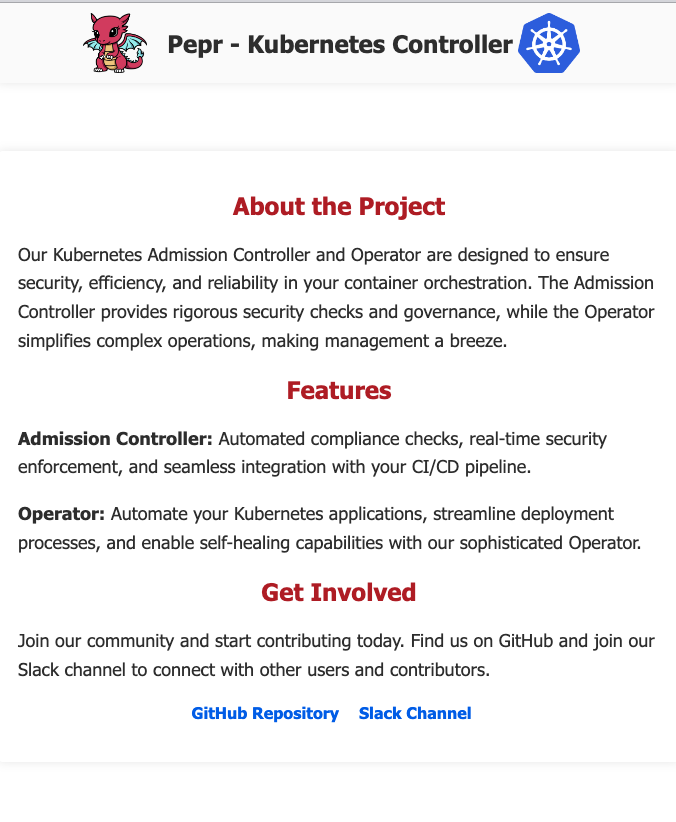

# Building a Kubernetes Operator with Pepr

## Introduction

This tutorial guides you through building a Kubernetes Operator using Pepr. You'll create a WebApp Operator that manages custom WebApp resources in your Kubernetes cluster.

If you get stuck at any point, you can reference the [complete example code in the Pepr Excellent Examples repository](https://github.com/defenseunicorns/pepr-excellent-examples/tree/main/pepr-operator).

## What You'll Build

The WebApp Operator will:

1. Deploy a custom `WebApp` resource definition (CRD)
2. Watch for WebApp instances and reconcile them with actual cluster state
3. For each WebApp instance, manage:
   - A `Deployment` with configurable replicas
   - A `Service` to expose the application
   - A `ConfigMap` containing configurable HTML with language and theme options

All resources will include `ownerReferences`, triggering cascading deletion when a WebApp is removed. The operator will also automatically restore any managed resources that are deleted externally.

[Back to top](#building-a-kubernetes-operator-with-pepr)

## Prerequisites

- A Kubernetes cluster (local or remote)
- Access to the `curl` command
- Basic understanding of Kubernetes concepts
- Familiarity with TypeScript
- Node.js ≥ 18.0

[Back to top](#building-a-kubernetes-operator-with-pepr)

## Tutorial Steps

1. [Create a new Pepr Module](#create-a-new-pepr-module)
2. [Define the WebApp CRD](#create-crd)
3. [Create Helper Functions](#create-helpers)
4. [Implement the Reconciler](#create-reconciler)
5. [Build and Deploy Your Operator](#build-and-deploy-your-operator)
6. [Test Your Operator](#test-your-operator)

[Back to top](#building-a-kubernetes-operator-with-pepr)

## Create a new Pepr Module

First, create a new Pepr module for your operator:

```bash
npx pepr init \
  --name operator \
  --uuid my-operator-uuid \
  --description "Kubernetes Controller for WebApp Resources" \
  --errorBehavior reject \
  --confirm &&
cd operator # set working directory as the new pepr module
```

To track your progress in this tutorial, let's treat it as a `git` repository.

Create an initial commit with:

```bash
git init && git add --all && git commit -m "npx pepr init"
```

[Back to top](#building-a-kubernetes-operator-with-pepr)

## Create CRD

The WebApp Custom Resource Definition (CRD) specifies the structure and validation for your custom resource.
Create the necessary directory structure:

```bash
mkdir -p capabilities/crd/generated capabilities/crd/source
```

Generate a class based on the WebApp CRD using [kubernetes-fluent-client](https://github.com/defenseunicorns/kubernetes-fluent-client).
This way we can react to the fields of the CRD in a type-safe manner.
Create a CRD named `crd.yaml` for the WebApp that includes:
- Theme selection (dark/light)
- Language selection (en/es)
- Configurable replica count
- Status tracking

```bash
curl -s https://raw.githubusercontent.com/defenseunicorns/pepr-excellent-examples/main/pepr-operator/capabilities/crd/source/crd.yaml \
  -o capabilities/crd/source/crd.yaml
```

Examine the contents of `capabilities/crd/source/crd.yaml`.
Status should also be listed under `subresources` to make it writable.
We provide descriptions under the properties for clarity around what the property is used for.
Enums are useful to limit the values that can be used for a property.

Create a interface for the CRD spec with the following command:

```bash
curl -s https://raw.githubusercontent.com/defenseunicorns/pepr-excellent-examples/main/pepr-operator/capabilities/crd/generated/webapp-v1alpha1.ts \
  -o capabilities/crd/generated/webapp-v1alpha1.ts
```

Examine the contents of `capabilities/crd/generated/webapp-v1alpha1.ts`

Create a TypeScript file that contains the webapp CRD named `webapp.crd.ts`.
This will have the controller automatically create the CRD on startup.
Use the command:

```bash
curl -s https://raw.githubusercontent.com/defenseunicorns/pepr-excellent-examples/main/pepr-operator/capabilities/crd/source/webapp.crd.ts \
  -o capabilities/crd/source/webapp.crd.ts
```

Take a moment to commit your changes for CRD creation with:

```bash
git add capabilities/crd/ && git commit -m "Create WebApp CRD"
```

Examine `webapp.crd.ts` and observe...
<!-- Point out some useful things here -->

Create a file that will automatically register the CRD on startup named `capabilities/crd/register.ts`. Use the command:

```bash
curl -s https://raw.githubusercontent.com/defenseunicorns/pepr-excellent-examples/main/pepr-operator/capabilities/crd/register.ts \
  -o capabilities/crd/register.ts
```

Examine `register.ts` and observe...
<!-- Point out some useful things here -->


Create a file to ensure that instances of the WebApp resource are in valid namespaces and have a maximum of `7` replicas.
Create a `validator.ts` file with the command:

```bash
curl -s https://raw.githubusercontent.com/defenseunicorns/pepr-excellent-examples/main/pepr-operator/capabilities/crd/validator.ts \
  -o capabilities/crd/validator.ts
```

Examine `validator.ts` and observe...
<!-- Point out some useful things here -->

In this section we generated the CRD class for WebApp, created a function to auto register the CRD, and added a validator to validate that instances of WebApp are in valid namespaces and have a maximum of `7` replicas.

Commit your changes for CRD registration & validation with:

```bash
git add capabilities/crd/ && git commit -m "Create CRD handling logic"
```

[Back to top](#building-a-kubernetes-operator-with-pepr)

## Create Helpers

Now, let's create helper functions that will generate the Kubernetes resources managed by our operator. These helpers will simplify the creation of Deployments, Services, and ConfigMaps for each WebApp instance.

Create a `controller` folder in the `capabilities` folder and create a `generators.ts` file. This file will contain functions that generate Kubernetes Objects for the Operator to deploy (with the ownerReferences auto-included). Since these resources are owned by the WebApp resource, they will be deleted when the WebApp resource is deleted.

```bash
mkdir -p capabilities/controller
```

Create `generators.ts` with the following command:

```bash
curl -s https://raw.githubusercontent.com/defenseunicorns/pepr-excellent-examples/main/pepr-operator/capabilities/controller/generators.ts \
  -o capabilities/controller/generators.ts
```

Examine `generators.ts` and observe...
<!-- Point out some useful things here -->

Our job is to make the deployment of the WebApp simple. Instead of having to keep track of the versions and revisions of all of the Kubernetes Objects required for the WebApp, rolling pods and updating configMaps, the deployer now only needs to focus on the `WebApp` instance. The controller will reconcile instances of the operand (WebApp) against the actual cluster state to reach the desired state.

We decide which `ConfigMap` to deploy based on the language and theme specified in the WebApp resource and how many replicas to deploy based on the replicas specified in the WebApp resource.

Commit your changes for deployment, service, and configmap generation with: 

```bash
git add capabilities/controller/ && git commit -m "Add generators for WebApp deployments, services, and configmaps"
```

[Back to top](#building-a-kubernetes-operator-with-pepr)

## Create Reconciler

Now, create the function that reacts to changes across WebApp instances. This function will be called and put into a queue, guaranteeing ordered and synchronous processing of events, even when the system may be under heavy load.

In the base of the `capabilities` folder, create a `reconciler.ts` file and add the following:

```bash
curl -s https://raw.githubusercontent.com/defenseunicorns/pepr-excellent-examples/main/pepr-operator/capabilities/reconciler.ts \
  -o capabilities/reconciler.ts
```

Examine `reconciler.ts` and observe...
<!-- Point out some useful things here -->

Finally create the `index.ts` file in the `capabilities` folder and add the following:

```bash
curl -s https://raw.githubusercontent.com/defenseunicorns/pepr-excellent-examples/main/pepr-operator/capabilities/index.ts \
  -o capabilities/index.ts
```

Examine `index.ts` and observe...
<!-- Point out some useful things here -->

- When a WebApp is created or updated, validate it, store the name of the instance and enqueue it for processing.
- If an "owned" resource (ConfigMap, Service, or Deployment) is deleted, redeploy it.
- Always redeploy the WebApp CRD if it was deleted as the controller depends on it

In this section we created a `reconciler.ts` file that contains the function that is responsible for reconciling the state of the instance with the cluster based on CustomResource and updating the status of the instance. The `index.ts` file that contains the WebAppController capability and the functions that are used to watch for changes to the WebApp resource and corresponding Kubernetes resources. The `Reconcile` action processes the callback in a queue guaranteeing ordered and synchronous processing of events

Commit your changes with

```bash
git add capabilities/ && git commit -m "Create reconciler for webapps"
```


[Back to top](#building-a-kubernetes-operator-with-pepr)

## Add capability to Pepr Module

Ensure that the PeprModule uses `WebAppController`, the implementation should look something like this:

```typescript
new PeprModule(cfg, [
  WebAppController,
]);
```

Commit your changes now that the WebAppController is part of the Pepr Module:

```bash
git add pepr.ts && git commit -m "Register WebAppController with pepr module"
```

## Build and Deploy Your Operator

> 🌟 **Key Concepts**: In this section, we'll transform our code into a running Kubernetes operator that actively monitors and manages WebApp resources in your cluster.

### Preparing Your Environment

Create an ephemeral cluster with `k3d`.

```bash
k3d cluster delete pepr-dev &&
k3d cluster create pepr-dev --k3s-arg '--debug@server:0' --wait &&
kubectl rollout status deployment -n kube-system
```

<details>
<summary>💡 What is an ephemeral cluster?</summary>
An ephemeral cluster is a temporary Kubernetes cluster that exists only for testing purposes. Tools like Kind (Kubernetes in Docker) and k3d let you quickly create and destroy clusters without affecting your production environments.
</details>

If you've followed the tutorial steps in a separate directory, skip this step.
If you've encountered issues deploying the operator to a cluster, use the pepr-excellent-examples version of the `pepr-operator` to see a working example.

If appropriate, Clone the Operator. Otherwise, move on.

```bash
git clone https://github.com/defenseunicorns/pepr-excellent-examples.git
cd pepr-operator
```

#### Update and Prepare Pepr

Make sure Pepr is updated to the latest version:

```bash
npx pepr update --skip-template-update
```

> ⚠️ **Important Note**: Be cautious when updating Pepr in an existing project as it could potentially override custom configurations. The `--skip-template-update` flag helps prevent this.

### Building the Operator

Build the pepr module by running:

```bash
npx pepr format && 
npx pepr build
```

Commit your changes now that a build has completed:

```bash
git add capabilities/ package*.json && git commit -m "Build pepr module"
```

<details>
<summary>🔍 What happens during the build process?</summary>

The `pepr build` command performs three critical steps:

1. **Compile TypeScript**: Converts your TypeScript code to JavaScript using the settings in tsconfig.json
2. **Bundle the Operator**: Packages everything into a deployable format using esbuild
3. **Generate Kubernetes Manifests**: Creates all necessary YAML files in the `dist` directory, including:
   - Custom Resource Definitions (CRDs)
   - The controller deployment
   - ServiceAccounts and RBAC permissions
   - Any other resources needed for your operator

This process creates a self-contained deployment unit that includes everything needed to run your operator in a Kubernetes cluster.

```
┌─────────────────────┐          ┌──────────────────┐          ┌───────────────────┐
│                     │          │                  │          │                   │
│  Your Pepr Code     │────────▶ │  pepr build      │────────▶ │ dist/             │
│  (TypeScript)       │          │  (Build Process) │          │(Deployment Files) │
│                     │          │                  │          │                   │
└─────────────────────┘          └──────────────────┘          └───────────────────┘
                                                                        │
                                                                        │
                                                                        ▼
                                                               ┌───────────────────┐
                                                               │                   │
                                                               │  Kubernetes       │
                                                               │  Cluster          │
                                                               │                   │
                                                               └───────────────────┘
```
</details>

### Deploy to Kubernetes

To deploy your operator to a Kubernetes cluster:

```bash
kubectl apply -f dist/pepr-module-my-operator-uuid.yaml &&
kubectl wait --for=condition=Ready pods -l app -n pepr-system --timeout=120s
```

<!-- Issue with CRD generation, updated pepr.ts -->
<details>
<summary>🔍 What's happening here?</summary>

1. The first command applies all the Kubernetes resources defined in the YAML file, including:
   - The WebApp CRD (Custom Resource Definition)
   - A Deployment that runs your operator code
   - The necessary RBAC permissions for your operator to function
   
2. The second command waits for the operator pod to be ready before proceeding. This ensures your operator is running before you attempt to create WebApp resources.
</details>

#### Troubleshooting Deployment Issues

<details>
<summary>❓ My operator isn't starting or is crashing</summary>

If your operator doesn't start properly, check these common issues:

1. **Check pod logs**:
   ```bash
   kubectl logs -n pepr-system -l app --tail=100
   ```
   
2. **Verify permissions**:
   ```bash
   kubectl describe deployment -n pepr-system
   ```
   Look for permission-related errors in the events section.

</details>

Verify the deployment was successful by checking if the CRD has been properly registered:

```bash
kubectl get crd | grep webapp
```

You should see `webapps.pepr.io` in the output, which confirms your Custom Resource Definition was created successfully.

#### Understanding the WebApp Resource

You can use `kubectl explain` to see the structure of your custom resource.
It may take a moment for the cluster to recognize this resource before the following command will work:

```bash
kubectl explain wa.spec
```

Expected Output:
```
GROUP:      pepr.io
KIND:       WebApp
VERSION:    v1alpha1

FIELD: spec <Object>

DESCRIPTION:
    <empty>
FIELDS:
  language      <string> -required-
    Language defines the language of the web application, either English (en) or
    Spanish (es).

  replicas      <integer> -required-
    Replicas is the number of desired replicas.

  theme <string> -required-
    Theme defines the theme of the web application, either dark or light.
```

> 💡 **Note**: `wa` is the short form of `webapp` that kubectl recognizes. This resource structure directly matches the TypeScript interface we defined earlier in our code.

[Back to top](#building-a-kubernetes-operator-with-pepr)

## Test Your Operator

> 🔄 **Key Concept**: Testing an operator involves verifying that it correctly responds to changes in your custom resources and maintains the desired state in your cluster.

### Understanding the Testing Strategy

We'll test our WebApp operator by:
1. Creating a WebApp resource to verify the operator creates all required components
2. Examining the status and events to verify proper operation
3. Testing the reconciliation loop by intentionally deleting owned resources
4. Updating the WebApp to see if changes are properly applied

<details>
<summary>💡 What is reconciliation?</summary>

Reconciliation is the core concept behind Kubernetes operators. It's the process of:
1. Observing the current state of resources in the cluster
2. Comparing it to the desired state (defined in your custom resource)
3. Taking actions to align the actual state with the desired state

This continuous loop ensures your application maintains its expected configuration even when disruptions occur.

```
┌───────────────────┐
│                   │
│  Custom Resource  │◄────────────┐
│  (WebApp)         │             │
│                   │             │
└───────┬───────────┘             │
        │                         │
        │ Observe                 │
        ▼                         │
┌───────────────────┐    ┌────────────────┐
│                   │    │                │
│  Pepr Operator    │───►│  Reconcile     │
│  Controller       │    │  (Take Action) │
│                   │    │                │
└───────┬───────────┘    └────────────────┘
        │                         ▲
        │ Create/Update           │
        ▼                         │
┌───────────────────┐             │
│  Owned Resources  │─────────────┘
│  • ConfigMap      │ If deleted or
│  • Service        │ changed, trigger
│  • Deployment     │ reconciliation
└───────────────────┘
```
</details>

### Creating a WebApp Instance

Let's create an instance of our custom `WebApp` resource in English with a light theme and 1 replica.
Copy down the WebApp resource with the following command:

```bash
curl -s https://raw.githubusercontent.com/defenseunicorns/pepr-excellent-examples/main/pepr-operator/webapp-light-en.yaml \
  -o webapp-light-en.yaml
```

Examine the contents of `webapp-light-en.yaml`. Observe...
Next, apply it to the cluster:

```bash
kubectl create namespace webapps &&
kubectl apply -f webapp-light-en.yaml
```

<details>
<summary>🔍 What happens when you create this resource?</summary>

1. Kubernetes API server receives the WebApp resource
2. Our operator's controller (in `index.ts`) detects the new resource via its reconcile function
3. The controller validates the WebApp using our validator
4. The reconcile function creates three "owned" resources:
   - A ConfigMap with HTML content based on the theme and language
   - A Service to expose the web application
   - A Deployment to run the web server pods
5. The status is updated to track progress

All this logic is in the code we wrote earlier in the tutorial.
</details>

### Verifying Resource Creation

Now, verify that the WebApp and its owned resources were created properly:

```bash
kubectl get cm,svc,deploy,webapp -n webapps
```

Expected Output:

```bash
NAME                                    DATA   AGE
configmap/kube-root-ca.crt              1      6s
configmap/web-content-webapp-light-en   1      5s

NAME                      TYPE        CLUSTER-IP   EXTERNAL-IP   PORT(S)   AGE
service/webapp-light-en   ClusterIP   10.43.85.1   <none>        80/TCP    5s

NAME                              READY   UP-TO-DATE   AVAILABLE   AGE
deployment.apps/webapp-light-en   1/1     1            1           5s
```

> 💡 **Tip**: Our operator created three resources based on our single WebApp definition - this is the power of operators in action!

### Checking WebApp Status

The status field is how our operator communicates the current state of the WebApp:

```bash
kubectl get wa webapp-light-en -n webapps -ojsonpath="{.status}" | jq
```

Expected Output:
```json
{
  "observedGeneration": 1,
  "phase": "Ready"
}
```

<details>
<summary>💡 What do these status fields mean?</summary>

- **observedGeneration**: A counter that increments each time the resource spec is changed
- **phase**: The current lifecycle state of the WebApp ("Pending" during creation, "Ready" when all components are operational)

This status information comes from our reconciler code, which updates these fields during each reconciliation cycle.
</details>

You can also see events related to your WebApp that provide a timeline of actions taken by the operator:

```bash
kubectl describe wa webapp-light-en -n webapps
```
Expected Output:
```
Name:         webapp-light-en
Namespace:    webapps
API Version:  pepr.io/v1alpha1
Kind:         WebApp
Metadata: ...
Spec:
  Language:  en
  Replicas:  1
  Theme:     light
Status:
  Observed Generation:  1
  Phase:                Ready
Events:
  Type    Reason                    Age   From             Message
  ----    ------                    ----  ----             -------
  Normal  InstanceCreatedOrUpdated  36s   webapp-light-en  Pending
  Normal  InstanceCreatedOrUpdated  36s   webapp-light-en  Ready
```

### Viewing Your WebApp

To access your WebApp in a browser, use port-forwarding to connect to the service.
The following command runs the portforward in the background.
Be sure to make note of the `Port-forward PID` for later when we tear down the test environment.

```bash
kubectl port-forward svc/webapp-light-en -n webapps 3000:80 &
PID=$!
echo "Port-forward PID: $PID"
```

<details>
<summary>💡 What is port-forwarding?</summary>

Port-forwarding creates a secure tunnel from your local machine to a pod or service in your Kubernetes cluster. In this case, we're forwarding your local port 3000 to port 80 of the WebApp service, allowing you to access the application at http://localhost:3000 in your browser.
</details>

Now open [http://localhost:3000](http://localhost:3000) in your browser or run `curl http://localhost:3000` to see the response in a terminal.
The browser should display a light theme web application:



### Testing the Reconciliation Loop

A key feature of operators is their ability to automatically repair resources when they're deleted or changed. Let's test this by deleting the ConfigMap:

```bash
kubectl delete cm -n webapps --all &&
sleep 10 && 
kubectl get cm -n webapps 
```

Expected output:
```
configmap "kube-root-ca.crt" deleted
configmap "web-content-webapp-light-en" deleted
NAME                          DATA   AGE
kube-root-ca.crt              1      0s
web-content-webapp-light-en   1      0s
```

Now that we've successfully deployed a WebApp, commit your changes:

```bash
git add webapp-light-en.yaml && git commit -m "Add WebApp resource for light mode in english"
```

<details>
<summary>🔍 What happened behind the scenes?</summary>

1. When you deleted the ConfigMap, Kubernetes sent a DELETE event
2. Our operator (in `index.ts`) was watching for these events via the `onDeleteOwnedResource` handler
3. This triggered the reconciliation loop, which detected that the ConfigMap was missing
4. The reconciler recreated the ConfigMap based on the WebApp definition
5. This all happened automatically without manual intervention - the core benefit of using an operator!
</details>

> 🛠️ **Try it yourself**: Try deleting the Service or Deployment. What happens? The operator should recreate those too!

### Updating the WebApp

Now let's test changing the WebApp's specification.
Copy down the next WebApp resource with the following command:

```bash
curl -s https://raw.githubusercontent.com/defenseunicorns/pepr-excellent-examples/main/pepr-operator/webapp-dark-es.yaml \
  -o webapp-dark-es.yaml
```

Compare the contents of `webapp-light-en.yaml` and `webapp-dark-es.yaml` with the command:

```bash
diff --side-by-side \
  webapp-light-en.yaml \
  webapp-dark-es.yaml
```

```bash
kubectl apply -f webapp-dark-es.yaml
```

> 💡 **Note**: We've changed the theme from light to dark and the language from English (en) to Spanish (es).

Your port-forward should still be active, so you can refresh your browser to see the changes.
If your porf-forward is no longer active for some reason, create a new one:

```bash
# Only needed if previous port-forward closed
kubectl port-forward svc/webapp-light-en -n webapps 3000:80 &
PID=$!
echo "Port-forward PID: $PID"
```

Now open [http://localhost:3000](http://localhost:3000) in your browser or run `curl http://localhost:3000` to see the response in a terminal.
The browser should display a dark theme web application:


Now that we've successfully updated a WebApp, commit your changes: 

```bash
git add webapp-dark-es.yaml && git commit -m "Update WebApp resource for dark mode in spanish"
```

<details>
<summary>🔍 How does updating work?</summary>

1. When you apply the changed WebApp, Kubernetes sends an UPDATE event
2. Our operator's controller (in `index.ts`) detects this via the `onUpdate` handler
3. The updated spec is validated and then queued for reconciliation
4. The reconciler compares the current resources with what's needed for the new spec
5. It updates the ConfigMap with the new theme and language content
6. The Deployment automatically detects the ConfigMap change and restarts the pod with the new content
</details>

### Cleanup

When you're done testing, you can delete your WebApp and verify that all owned resources are removed:

```bash
kill $PID && # Close port-forward
kubectl delete wa -n webapps --all && 
sleep 5 &&
kubectl get cm,deploy,svc -n webapps
```

### What You've Learned

Congratulations! You've successfully:

1.  Created a custom WebApp resource
2.  Verified that your operator automatically creates owned resources
3.  Tested the reconciliation loop by deleting owned resources
4.  Updated your WebApp and seen the changes reflected

This pattern is powerful for creating reusable, self-managing applications in Kubernetes. 
Your operator now handles the complex task of maintaining your application's state according to your specifications, reducing the need for manual intervention.

[Back to top](#building-a-kubernetes-operator-with-pepr)

## Next Steps

- Add more sophisticated validations for your WebApp CRD
- Implement more detailed status reporting
- Add support for horizontal auto-scaling
- Create a custom metrics dashboard for your WebApp

For more examples and reference, check out the [Pepr documentation](https://docs.pepr.dev) and [Pepr GitHub repository](https://github.com/defenseunicorns/pepr). Also, checkout the finished example in [Pepr Excellent Examples](https://github.com/defenseunicorns/pepr-excellent-examples/tree/main/pepr-operator).

[Back to top](#building-a-kubernetes-operator-with-pepr)