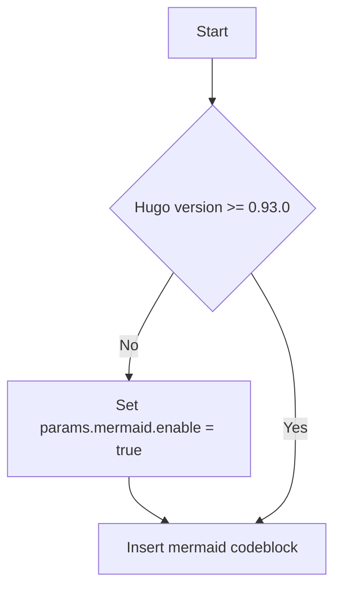

<!-- 
In certain instances a markdown viewer may not display due to
the '---' frontmatter block above. If you're one of those edge
cases enclose the frontmatter at the top of this file entirely
within a comment block just like this comment.
-->

